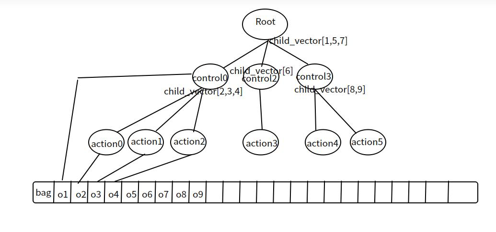

# OverView

As shown in the figure, the tree itself maintains the relationships between nodes. At the same time, the ID of Node will  
be key in the bag, and the data of node will be the store corresponding to key. In the bag we can store arbitrary data. 

Because dynamic calls and recursive calls cannot be made in move, a stack is used in the tick script to save intermediate  
execution results. The stack is also used during the traversal of the behavior tree, which makes the code very bloated and unclear.